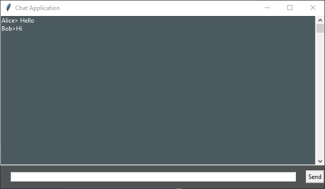

# A Multi-Client Chat Application

## Features

- Multi-threaded chat client and server
- Supports multiple clients
- Supports logging
- GUI + CLI intefraces


## Usage

**chat_server.py**

```bash
usage: chat_server.py -p PORT --file LOG_FILE

optional arguments:
  -h, --help            show this help message and exit
  -p 				   port
  --file 			   log file name
```


**chat_client.py**

```bash
usage: chat_client.py -i SERVER_ADDRESS -p PORT --mode GUI/CLI

optional arguments:
  -h, --help   show this help message and exit
  -i ip        Chat server IP
  -p port
  --mode MODE  Client interface (e.g. CLI, GUI)
```


## Examples

**Server**

```bash
python chat_server.py -p 5555 --file log1.txt
Listening 127.0.1.1:5555
```


**Client**

```bash
python chat_client.py -i 127.0.1.1 -p 5555 --mode GUI
Welcome to the chat room!
Please Enter your name:
Alice
```


**Screenshot**



